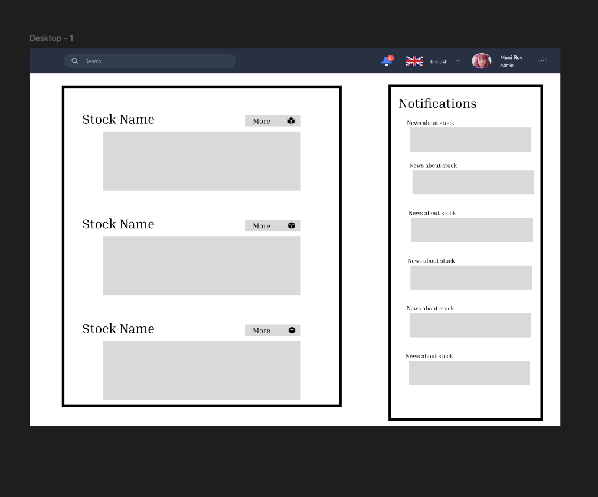

# StockerV1
This is a web application that will use AI to give information about stocks of your choice. 

[Notes](notes.md)

## Elevator Pitch

Everyone and their uncle has thought about making a stock predictor to do day trading (They never work!). What you need instead is to have an easy service that will help you know what the companies of your choice is doing right now. Stocker is here to help you by using AI to analyze the most popular news sources for you so you can always be informed. Stocker, spend more time investing and less time reading!

## Design

## Key Features

- Over 10 top news sources supported
- Get summaries of what your companies are doing right now
- Get information in realtime
- Use AI to ask questions about your companies
- Login to save stocks to your watch list
                
## Technologies
I am going to use the required technologies in the following ways.

- **HTML** - Correct use of HTML for structure of 3 pages. (Homepage, Stocks Browsing, Personal Stocks)
- **CSS** - Styling each page to look good on different aspect ratios and colors.
- **React** - Using JS to allow for login, searching, and bookmarking of stocks.
- **Web service** - Endpoints for:
    - Login
    - Adding Bookmarks
    - Retrieving Stocks
    - AI Api
    - New Apis
- **Database**: Store logins, user stock bookmarks, news information, and stock information securely in database.
- **WebSocket**: As an user logs in, real time data is displayed for each stock and news information.

## Deployment